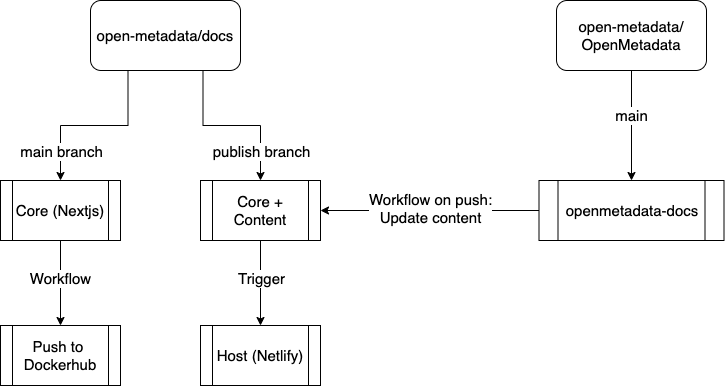
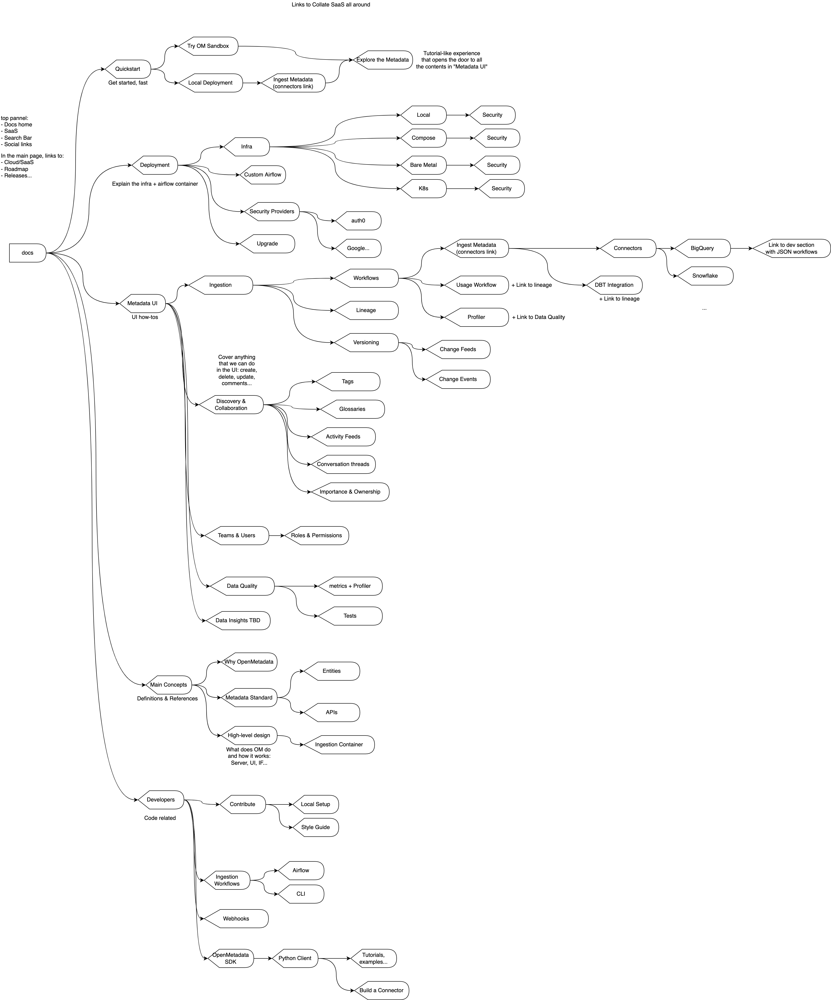

# OpenMetadata Docs

This is the main repository hosting the core implementation of the OpenMetadata docs.

The end-to-end setup is showcased in the figure below:



Then, the process of contributing to the docs depends on whether you are a core contributor and need to update the layout, components, styles, etc. or you are a content contributor.

## I am a Content Contributor

Your role here is to update the markdown files and menu, i.e., anything content related without needing core changes in terms of layout, landing page, components...

### Start the docs server

From the OpenMetadata repository, run `make docker-docs`. This will pull the `latest` published image from our docs in development mode. It also runs the container passing some volumes
that will pick up the content of the files under `openmetadata-docs`. In there, you will find all the directories with content you might ever need to change:
- `content/` for the main markdown files
- `images/` to add necessary images from the `content/`
- `ingestion` for the YAML files that will be generated via the connector component templates. More info on [hot to add a new connector](#how-to-add-a-new-connector).

### How to add new docs

This is a high-level view of the docs' organisation:



To add a new page:
1. Add the entry under `site_menu` in `content/menu.md`. Make sure you're following the right structure in the `category` (using names) and `url` (building the path). Note that the URL **should match** the actual directory so that we can better understand where to find each file.
2. In the file path, create a markdown file. You can name it either as `index.md`, if it is the presentation of a section, or `something.md` if it is a detailed entry.
3. Each `md` file will have the following header (example from `content/openmetadata/ingestion/lineage.md`):
    ```
    ---
    title: Entity Lineage
    slug: /openmetadata/ingestion/lineage
    ---
    ```
   The title will be the Page title, and the `slug` will need to match the `url` specified in the `menu.md`.
4. If you need to add any image, they should be placed under `public/images/`, using the same directory structure as the `md` file. You can then add them with `` with normal markdown.
    The path will start from `images`, e.g., `/images/openmetadata/ingestion/lineage/my-image.png`. The same path philosophy applies here, create the structure in the images directory that follows the same as the URL and markdown path.

### How to add a new connector

1. Create a new directory with the service type and connector name under `/content/openmetadata/ingestion/workflows/metadata/connectors/{service}/{connector}`. Supported services are `database`, `messaging`, `dashboard` and `metadata`.
2. Create an `index.md`, `airflow.md` and `cli.md` files. You can copy the main structure of any other connector.
3. Update the title and slug.
4. Update the connector name and specify if it has usage with `hasUsage="true"` in the components.
5. Add the Connection Options in each markdown file.
6. Add the `ingestion.yaml`, `usage.yaml` (if required) and `profiler.yaml` under `/public/ingestion/connectors/{connector}`.
7. Add screenshots of `add-new-service.png`, `select-service.png` and `service-connection.png` under `/public/images/openmetadata/ingestion/workflows/metadata/connectors/{connector}`.

If the templates need to be updated, this requires updating the components from the docs repo under `components/content`. For that, follow the steps of [core contributors](#i-am-a-core-contributor).

## I am a Core Contributor

As a documentation core contributor, your role is managing the look and feel of the site, as well as creating new components, updating versions of the required libraries, or any activity directly related to the NextJS code.

In this case, you can:
- [Build the docs from source](#local-build-from-source)
- or if you need to check your changes against the main content, [build the docker locally](#build-local-docker)

Note that from the `main` branch we have some dummy content in a couple of directories:
1. `content/`: with the meny and placeholder directory
1. `public/ingestion/connectors/`, with a dummy YAML file needed to build the code.

Note that `content`, `public/images` and `public/ingestion` are directories that will be continiously overwritten in the `publish` branch, so do not commit any changes there.

## Local Build from source

To build the docs, clone this repo, install the NPM dependencies, and start the development server.

You might need to run `brew install node next` before.

1. Clone this repo:

```bash
git clone https://github.com/open-metadata/docs.git
cd docs/
```

2. Install the NPM dependencies

```bash
make
```

3. Start the development server:

```bash
make up
```

The docs will be viewable at [http://localhost:3000](http://localhost:3000). Running the core docs like this won't have the main content available, as those markdown files live under the OpenMetadata main repo.

However, this is a fast way to develop new components or do changes to the index page, navigation bar or any other piece of content not related to the markdown parsing. Even if the later scenario was true,
you can just create dummy content and not push it to test your changes.

If for any reason, you need to test your changes against the main content, you will need to [build the local docker](#build-local-docker).

## Troubleshoot Local Run

If you are having trouble bringing the server up, a couple of things to check:
- `node` version ~16.15
- try `npm install --force` & `npm install --legacy-peer-deps`

## File and folder structure

This repo follows a typical Next.js project structure. To contribute, you'll only edit Markdown files within the `content/` folder.

- `components/` Contains JS and MDX files.
  - `components/content/` Has the templates for building the connector docs. 
- `content/` This is where all the Markdown files live. This is the only folder you'll edit.
- `lib/` Contains JS files.
- `pages/` You'll never have to edit this folder. It contains JSX files that handle the complex index page, mapping of URL slugs, and rendering of Markdown pages in `content/`.
- `public/` Contains all the images and YAML files.
- `scripts/` Contains JS files.
- `styles/` Contains CSS files for styling and layout.

## Build Local Docker

If you want to build a docker image containing the docs locally, you can run `make docker-build`. This will create a local image of the documentation named `openmetadata=docs:local`.

This image can then be used with the actual content by running `make docker-docs-local` in the OpenMetadata main repo.

## Update Latest Published Image

There is a Github Action that you can manually trigger from `main` (directly from Github UI). You can go to `Actions > docker-docs > Run Workflow`. This will automatically build and push on the `latest` tag.

We need to do this each time we want to make some changes available to content developers.

# How is this deployed to Netlify

The repo is synced with Netlify using the branch `publish`. What happens is the following:

1. To update core content: merge `main` into `publish` branch to have the latest components, layouts, etc. available to be published.
1. The content is updated automatically. There is a Github Action in OpenMetadata main repo that each time that the `openmetadata-docs` are updated, copies the directories in there and OVERWRITES the content in the `publish` branch.

Then, as Netlify is synec with `publish`, any update in that branch will trigger a deployment.

## Kudos

This repo has been inspired on Streamlit's [documentation framework](https://github.com/streamlit/docs)!
